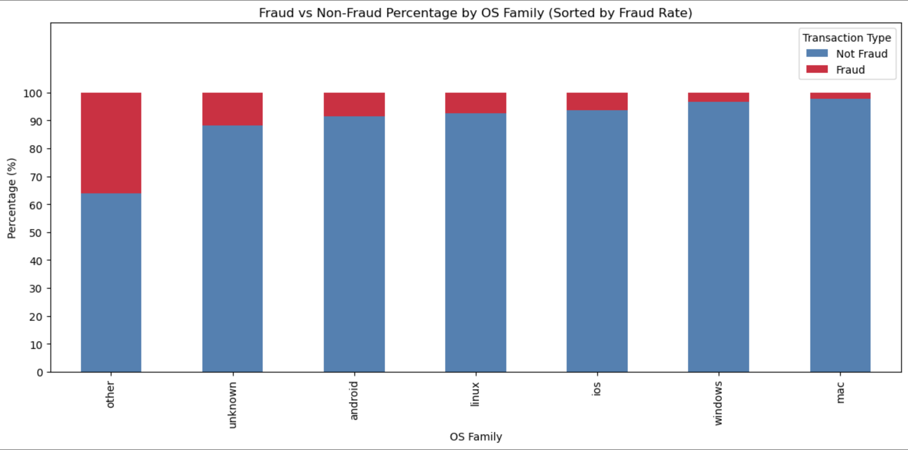
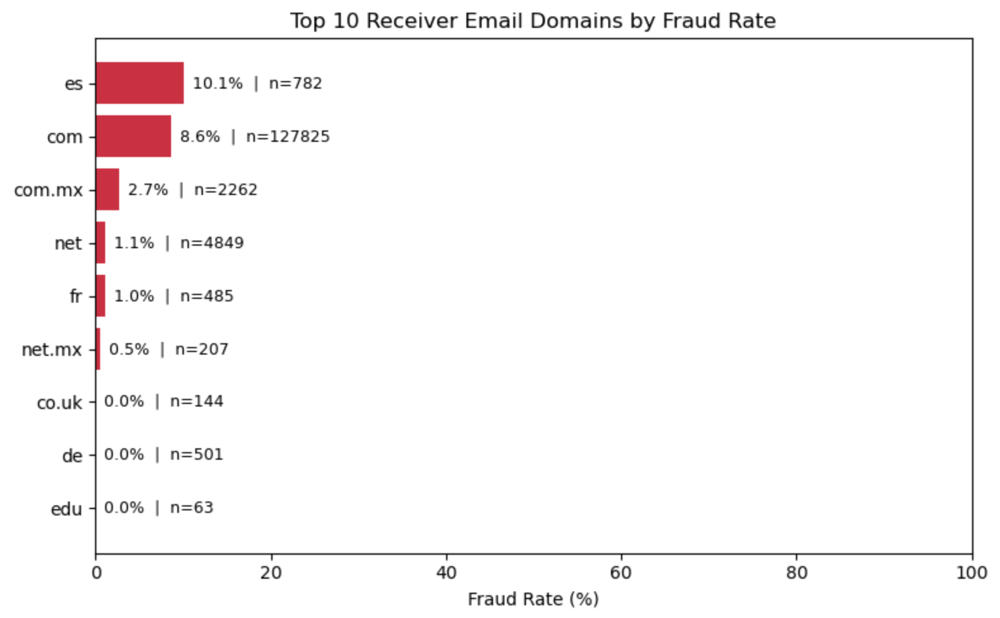
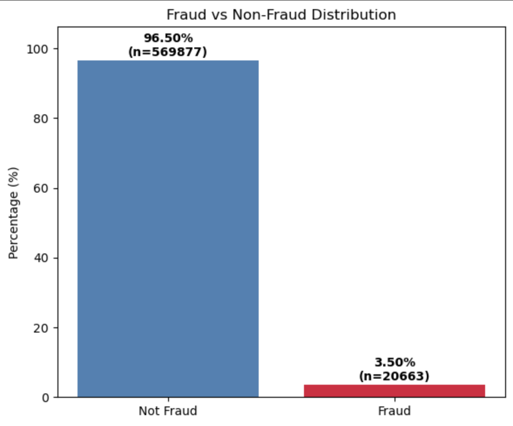

# Bank Transfer Fraud Detection – IEEE-CIS Kaggle Competition


[](https://opensource.org/licenses/MIT)  
[](https://www.python.org/downloads/release/python-3130/)

This repository contains a comprehensive **Exploratory Data Analysis (EDA)** and **machine learning solution** for the [IEEE-CIS Fraud Detection](https://www.kaggle.com/competitions/ieee-fraud-detection) Kaggle competition.

The goal is to predict whether an online transaction is fraudulent (`isFraud`) using real-world e-commerce transaction data provided by Vesta Corporation.

The notebook performs deep EDA, feature engineering, careful leakage-free preprocessing, model comparison, hyperparameter optimization with Optuna, and final LightGBM training — achieving strong validation **PR-AUC ~0.575**.

## Table of Contents

- [Project Overview](#project-overview)
- [Objectives](#objectives)
- [Dataset](#dataset)
- [Notebook Structure](#notebook-structure)
- [Key Findings](#key-findings)
- [Machine Learning Model](#machine-learning-model)
- [Requirements](#requirements)
- [How to Reproduce](#how-to-reproduce)
- [Contributing](#contributing)
- [License](#license)
- [Credits and Acknowledgements](#credits-and-acknowledgements)
- [Author](#author)
  
---
## Project Overview

Online payment fraud causes massive financial losses every year. This project analyzes anonymized transaction and identity data to uncover fraud patterns and build a reliable classifier.

### Tools & Libraries used
- **Pandas**, **NumPy** — data manipulation  
- **Seaborn**, **Matplotlib**, **Altair** — static & interactive visualizations  
- **Scikit-learn** — preprocessing, metrics, pipelines  
- **LightGBM**, **XGBoost**, **CatBoost** — gradient boosting models  
- **Optuna** — hyperparameter tuning  
- **Joblib** — model & preprocessor persistence
- **Power Bi** - Quick Dataset overview Dashboard
- **Figma** - Dashboard layout design

**Key components:**
- Datasets: `train_transaction.csv`, `train_identity.csv`, `test_transaction.csv`, `test_identity.csv` (not availiable on repository, download from Kaggle ~ 1Gb)
- Main Notebook: `Transaction_Fraud_Detection_ETA_ML.ipynb`
- Power Bi Dashborad: `dataset_overview.pbix` [open on server](https://app.powerbi.com/view?r=eyJrIjoiZjFhMWY4NGMtNzI3NC00ZmVhLThmODQtMjJmMjVmYTNmMjllIiwidCI6IjU5YTZhM2Y5LTMwYWItNDBmZi1hNDZhLWYzZThkZDU4OGZhOSIsImMiOjl9)
---
## Objectives
- Understand fraud rate (~3.5%) and severe class imbalance
- Analyze missingness patterns (especially identity table — only ~24% coverage)
- Discover high-risk segments (product codes, email domains, device types, amounts, time-of-day)
- Engineer safe, leakage-free features (device risk encoding, email domain grouping, row-wise statistics)
- Build and tune gradient boosting models with focus on **PR-AUC** (suitable for heavy imbalance)
- Create production-ready inference bundle (preprocessor + model)

---
## Dataset
**Source:** [Kaggle IEEE-CIS Fraud Detection](https://www.kaggle.com/competitions/ieee-fraud-detection/data)  
**Size:**  
• train_transaction: 590,540 rows × 394 columns  
• train_identity:   144,233 rows × 41 columns  

**Main files:**
- `train_transaction.csv` — core transaction features + target `isFraud`
- `train_identity.csv`    — device, browser, IP-related identity info (sparse)
- Test files follow the same structure (no target)

**Important notes:**
- Extremely wide dataset (hundreds of anonymized Vesta features — `V1`–`V339`)
- Heavy missing values, especially in identity & some V columns
- High-cardinality categoricals (emails, device info, card IDs)
- Time feature `TransactionDT` — timedelta from unknown reference

---
## Notebook Structure
1. Libraries & Data Loading  
2. Basic checks (shape, types, missing, duplicates)  
3. Deep EDA  
   - Fraud rate & imbalance visualization  
   - Missingness comparison (with vs without identity info)  
   - High-risk segments (product, card, email, device)  
   - Amount, time, and categorical fraud patterns  
4. Feature Engineering (leakage-safe)  
   - Email domain extraction & grouping  
   - Device risk target encoding (train-only fit)  
   - Row-wise statistics, boolean conversions  
5. Preprocessing Pipeline (sanitization → encoding → scaling)  
6. Model Training & Tuning  
   - Baseline → LightGBM / XGBoost / CatBoost comparison  
   - Optuna tuning (PR-AUC optimization, 60 min budget)  
   - Time-based train/validation split  
7. Final Model & Inference Bundle  
   - Retrain on 100% data with best iteration  
   - Save preprocessor + model (`lgbm_bundle.joblib`)  
8. Test predictions & threshold selection

---
## Key Findings
- Only ~3.5% of transactions are fraudulent → strong imbalance 
- Certain **ProductCD** values (especially 'C' & 'R') and some email providers are much riskier
- The dataset exhibits a high degree of missingness, affecting the majority of features
- Missing identity data itself is predictive
- **DeviceInfo** fingerprinting + rare devices → strong fraud signal   
- Strongest engineered feature: **device-level target-encoded risk**
- Mac devices were the most free of fraud. "Others", "unknown" and Android are the most fraudulent, but no extreme skeve
- Screen sizes 1024x600 and 0x0 have the most Fraud risk
- The ‘Outlook’ email provider and the ‘.se’ and ‘.com’ domains are the most fraud-related
- Missing receiver email information is not a predictor of fraud

  #### Few visuals from the notebook attached below




  

  
*(more visuals inside notebook — correlation heatmaps, boxplots etc.)*

---
## Machine Learning Model
**Final choice:** LightGBM  
**Validation metric (focus):** PR-AUC ≈ **0.575** (strong improvement over baseline ~0.03)  
**Best parameters found via Optuna:**
```text
num_leaves:        94
max_depth:         9
learning_rate:     0.0714
colsample_bytree:  0.860
subsample:         0.926
reg_alpha:         0.001
reg_lambda:        0.558
min_child_samples: 65
n_estimators:      583 (early stopping)
```
Inference is bundled into one .joblib file containing:
* Device risk encoder (target encoding fitted on train)
* Full sklearn pipeline (sanitizer → converters → engineer → preprocessor)
* Trained LightGBM model

---
## Requirements

manually in terminal:
```bash
  pip install \
  pandas>=2.0 \
  numpy>=1.24 \
  seaborn>=0.12 \
  matplotlib>=3.7 \
  lightgbm>=4.0 \
  xgboost>=2.0 \
  catboost>=1.2 \
  optuna>=3.0 \
  scikit-learn>=1.3 \
  joblib>=1.2 \
  altair>=5.0
```

---
## How to Reproduce
### **1. Clone the repository**
```bash
git clone https://github.com/vdafeider/ieee_fraud_detection_analysis_and_ml.git
cd ieee_fraud_detection_analysis_and_ml
```
### **2. Install dependencies**
See above [requirements](#Requirements)

### **3. Run the notebook**
```bash
jupyter notebook
```
Open `Transaction_Fraud_Detection_ETA_ML.ipynb` → **Restart & Run All**.

### *4. Generate test predictions**
Notebook already contains final prediction code using saved bundle
Output: columns isFraud_float (probability) + isFraud (binary @ threshold ≈0.27)

---
## Contributing
Feel free to fork and submit PRs.
Especially welcome:
* Additional strong features (time-based, card grouping, interaction terms)
* Alternative models (TabNet, NN, stacking) or Deep Learning
* Better handling of high-cardinality categoricals

Please follow best practices:
- Fork the repository
- Create a feature branch
- Commit with clear messages
- Open a Pull Request

If you plan to contribute regularly, consider adding:
- `CONTRIBUTING.md`
- `CODE_OF_CONDUCT.md`

---

## License
This project is licensed under the **MIT License**.

---

## Credits and Acknowledgements
The content of this project represents the understanding gained from the walkthrough projects provided by **Code Institute**.  

Issues encountered during development were resolved by **leveraging official documentation, community forums, and best practices** from resources including Stack Overflow, Python library documentation, and YouTube tutorials. 

Great thanks to Dataset owners for data share: Vesta Corporation via IEEE-CIS Fraud Detection @ Kaggle

A huge thanks to **John Anih**, who introduced me to this course.

---

## Author
**Volodymyr Babunych**  
📧 vbabunych@gmail.com  
📍 United Kingdom  
🗓️ January 23, 2026

